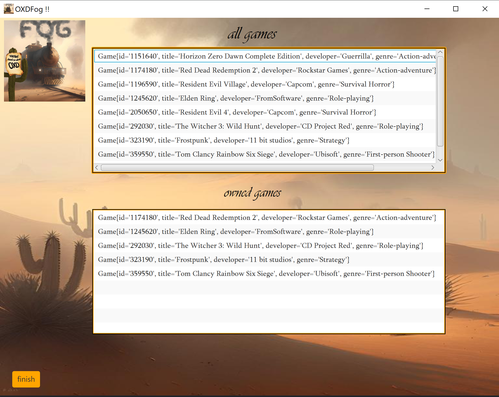

# In the name of god
# OXDFog 
## a video game digital distribution service

# Introduction
The video game industry has grown tremendously over the past few decades, and one of the significant changes that have taken place is the shift toward digital distribution. Video game digital distribution services, such as Steam, Epic Games Store, and GOG, have become increasingly popular among gamers, offering a convenient and efficient way to purchase and download games.

In this Java application, we will be building a video game digital distribution service app from scratch. This app will allow users to browse, purchase, and download games from a curated selection of titles. We will be using Java to build the app's backend functionality, such as user authentication, and game catalog management. We will also build a graphical user interface (GUI) using JavaFX, to provide users with an intuitive and aesthetically pleasing experience.

# Design and Implement
at first, you should install 

 

on your computer and then run the Postgres image in this way
`docker run --name OXDFog-postgres --hostname=dbc768ac8220 --env=POSTGRES_PASSWORD=mysecretpassword --env=PATH=/usr/local/sbin:/usr/local/bin:/usr/sbin:/usr/bin:/sbin:/bin:/usr/lib/postgresql/15/bin --env=GOSU_VERSION=1.16 --env=LANG=en_US.utf8 --env=PG_MAJOR=15 --env=PG_VERSION=15.2-1.pgdg110+1 --env=PGDATA=/var/lib/postgresql/data --volume=/var/lib/postgresql/data -p 5433:5432 --restart=no --runtime=runc -d postgres`
and then run this command as follows
`docker exec -it OXDFog-postgres bash` , 
`su - postgres` ,  
`psql` , 
`CREATE ROLE oxd with login SUPERUSER PASSWORD ‘passowrd’;` , 
`ALTER USER oxd WITH CREATEDB CREATEROLE;` , 
`\q` , 
`exit` , 
`exit` , 
so we can connect to our database that is running in a docker container and listening on port 5433 on localhost with username: oxd and password: password
to connect to the database from our program we use the Postgres Java library as they mentioned in their documentation.
## class UML diagrams

to make the connection between the server and the client we first made a socket in the client and a server socket in the server app when the client socket wants to start a handshake with each other the server accepts the request and then the client and the server can send data to each other using the input and output streams
when the client wants a piece of information or has an order sends the meaningful string to the server and the server handle inputs and response to the client information.

Anyone who is younger than the minimum age required for a game cannot download the game

using a multithreading to handle multi clients.
to handle this when a client sends a request to connect to the server ,the server made a new thread for it and then receives and sends the response to the client from this thread.
# screenshots of the app

# Conclusion
Overall, this project has demonstrated the power and versatility of Java as a programming language for developing complex applications. By building this video game digital distribution service app, we have shown how Java can be used to create high-performance, reliable software that meets the needs of users and developers alike.